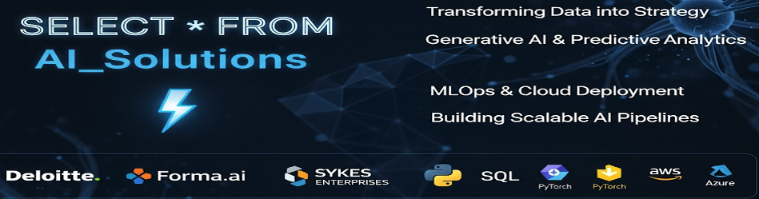

<!-- Profile Banner -->

  

<h1 align="center">
  Hi there, This is Zabihullah Zabih 👋
</h1>

<!-- Typing Animation -->

  

---

## 🚀 About Me
I’m a **Machine Learning Engineer & Data Scientist** who builds AI solutions that deliver measurable business impact.  
Specialized in **Generative AI, NLP, Predictive Analytics, and Big Data Engineering**, I create scalable pipelines and deploy production-ready models on cloud platforms.

---

## 🛠 Tech Stack

  
  
  
  
  
  
  

---

## 📊 GitHub Stats

  
  

---

## 💼 Career Highlights
- 🛠 **AI Financial Document Analysis Tool** → Cut review time by **40%**, improved retrieval accuracy by **35%**  
- ⚡ **Optimized ETL Pipelines** → Reduced processing time by **50%** for faster analytics  
- 🤖 **Generative AI Chatbot** using GPT-4, LLaMA-2, and Mistral → Reduced hours of manual work to seconds  
- 📊 Built dashboards → Improved strategic planning efficiency by **15%**  

---

## 📫 Let’s Connect

  
  

---

💡 *"Turning data into strategy, one model at a time."*
